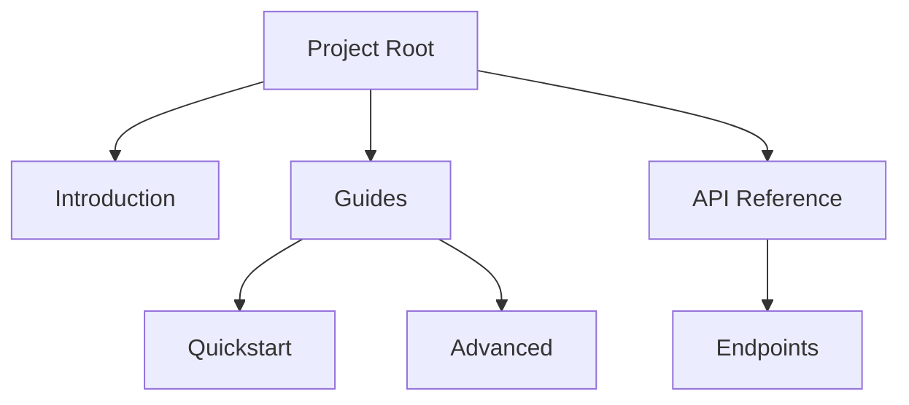

## Overview

Paradoha gh empowers you to create, organize, and share professional documentation for your projects. You get intuitive tools for building hierarchical structures, collaborating with teams, searching content efficiently, and publishing to the web. These features help you maintain living docs that scale with your needs.

<Columns cols={3}>
  <Card title="Organization" icon="folder" href="#document-organization">
    Build nested hierarchies with folders and pages.
  </Card>
  <Card title="Collaboration" icon="users" href="#collaboration">
    Work with teams using version control.
  </Card>
  <Card title="Search & Navigation" icon="search" href="#search-navigation">
    Find content quickly with smart tools.
  </Card>
</Columns>

## Document Organization and Hierarchy

You structure your docs using a flexible folder-based system. Create nested hierarchies to mirror your project's architecture, from high-level overviews to detailed API references. Paradoha gh supports MDX files for rich content with components like `<Callout>` and code blocks.



<Steps>
  <Step title="Create Folders" icon="folder-plus">
    In your dashboard, click "New Folder" to organize sections.
  </Step>
  <Step title="Add Pages" icon="file-plus">
    Upload MDX files or create new ones directly.
  </Step>
  <Step title="Reorder" icon="move">
    Drag and drop to set the hierarchy.
  </Step>
</Steps>

## Collaboration and Version Control

Invite team members to edit docs in real-time or via Git integration. You track changes with commit history, branches, and pull requests, ensuring no work is lost.

<Tabs>
  <Tab title="GitHub" icon="github">
    Connect your repo for seamless sync.
    
````bash
git clone https://github.com/your-org/project-docs.git
cd project-docs
git add docs/features.mdx
git commit -m "Update features page"
git push origin main
````
  </Tab>
  <Tab title="Direct Edits" icon="edit-3">
    Use the web editor for quick changes without local setup.
    
    <Callout kind="tip">
      Enable previews to review changes before publishing.
    </Callout>
  </Tab>
</Tabs>

## Search and Navigation Tools

Paradoha gh includes full-text search across all docs, with filters for sections and tags. Navigation uses a dynamic sidebar that auto-generates from your hierarchy, plus breadcrumbs for context.

<Expandable title="Advanced Search Filters" default-open="true">
  Search by keywords, filter by `{tags=["api", "guide"]}`, or limit to recent updates.
</Expandable>

| Feature | Description |
|---------|-------------|
| Global Search | Instant results with highlighting |
| Sidebar Navigation | Collapsible tree view |
| Breadcrumbs | Quick path back to root |
| Tags | Categorize pages for filtering |

## Publishing and Sharing Options

Publish your docs to a custom domain or share via links. Embed pages in your site or generate static exports.

<CodeGroup tabs="Embed,Static Export">
  ```html
  <iframe src="https://docs.paradoha-gh.com/embed/features" width="100%" height="600"></iframe>
  ```
  ```bash
  npx paradoha-gh export --output ./dist
  # Serves static site from ./dist
  ```
</CodeGroup>

<Callout kind="success">
  Start by organizing your root folder, then invite collaborators to build together.
</Callout>

<Columns cols={2}>
  <Card title="Quickstart" icon="rocket" href="/quickstart">
    Set up your first project.
  </Card>
  <Card title="API Reference" icon="code" href="/api">
    Integrate programmatically.
  </Card>
</Columns>